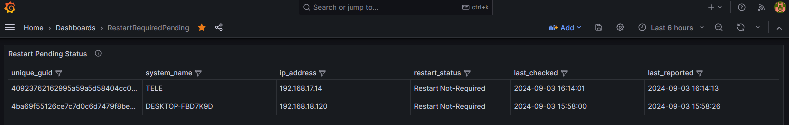

# Restart Pending Detector
<br /> Restart pending Detector and Reporter for Microsoft Windows server and workstation is a tool that check the OS and findout if the OS needs reboot. It is proper to use on all Microsoft Windows OS.

<br /> You can run the **Restart_Pending_Detector.exe** (by Administrator privilege) then find the **Restart_Pending_Detector.log** from current path to find out whether or not your Windows OS needs restart.

<br /> You can run the **Restart_Pending_Reporter.exe** (by Administrator privilege) to send the generated logs to the database (all credentials will be encrypted and stored in current path, credentials are store just one time and you do not have to set them every time you run the Restart_Pending_Reporter.exe or at task scheduled)

# How to use it:

<br /> 1- Create a folder and downlowd **Restart_Pending_Detector.exe** and **Restart_Pending_Reporter.exe** into the folder.

<br /> 1- Run **Restart_Pending_Reporter.exe** in a cli (cmd, owershell ...)

# How to setup a database:

<br /> To send the report logs to the database follow these steps:

- Install MSsql database on a server which logs will be gathered
  
- login to mssql server as sa

- create a user in mssql with the very secure password (username sample = "restartdetector")

- create a database named: "RestartPendingDetector" (DO OT Change it - exactly use this name) 

- set the mentioned sql "username sample = "restartdetector"" as the DB owner of RestartPendingDetector database

- run the following query on the RestartPendingDetector Database
```
IF NOT EXISTS (SELECT * FROM sysobjects WHERE name = 'RestartPendingDetector' AND xtype = 'U')
BEGIN
    CREATE TABLE RestartPendingDetector (
        unique_guid NVARCHAR(255) PRIMARY KEY,
        system_name NVARCHAR(255),
        ip_address NVARCHAR(50),
        restart_status NVARCHAR(50),
        last_checked DATETIME,
        last_reported DATETIME
    );
    PRINT 'Table RestartPendingDetector created successfully.';
END
ELSE
BEGIN
    PRINT 'Table RestartPendingDetector already exists.';
END
```
- login with the user (sample = "restartdetector") to make sure of DB connection is ok

- <br /> now Run **Restart_Pending_Reporter.exe** in a cli (cmd, owershell ...) and use the mssql credential then check the database table

- logs will be stored into RestartPendingDetector table

- To use **Restart Pending Detector** with the same credential on other sytems, you can copy **private_key.pem**, **public_key.pem** and **secret.json** in the same folder on other systems

- you can find logs on mssql by the following query - run in on **RestartPendingDetector** database 
```
/****** Script for SelectRows command from SSMS  ******/
SELECT [unique_guid]
      ,[system_name]
      ,[ip_address]
      ,[restart_status]
      ,[last_checked]
      ,[last_reported]
  FROM [RestartPendingDetector].[dbo].[RestartPendingDetector]
```
# Scheduled Task

- now you can create a schedule task to re-run the Restart_Pending_Reporter.exe and send the report to the database time to time.

# Grafana Dashboard 

- you can setup the data source in grafana then import the RestartRequiredPending_Dashboard.json
  


# Secret Decryptor

- to decrypt the secret.json to t-shoot problems you can run **decrypt_secret.exe**


